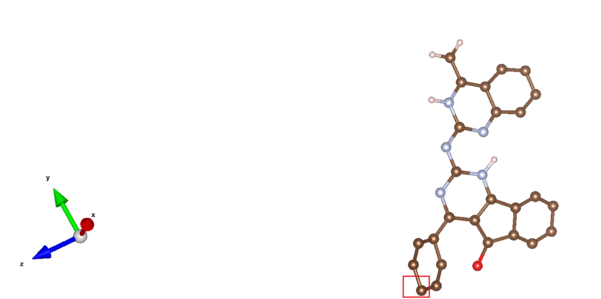

<!-- TOC -->

- [Matgen-toolkit](#matgen-toolkit)
  - [Installation](#installation)
    - [Environment](#environment)
    - [Compile](#compile)
    - [Configuration](#configuration)
  - [Remove Solvents](#remove-solvents)
    - [Description](#description)
    - [Usage](#usage)
    - [Example](#example)
  - [Find Space Groups](#find-space-groups)
    - [Description](#description-1)
    - [Usage](#usage-1)
    - [Example](#example-1)
    - [Problem && Solution](#problem--solution)
  - [In-Cell](#in-cell)
    - [Description](#description-2)
    - [Usage](#usage-2)
    - [Example](#example-2)
  - [ICSD' Classify And Unique](#icsd-classify-and-unique)
    - [Description](#description-3)
    - [Usage](#usage-3)
    - [Example](#example-3)
  - [CSD' Classify](#csd-classify)
    - [Description](#description-4)
    - [Usage](#usage-4)
    - [Example](#example-4)
  - [Format](#format)
    - [Description](#description-5)
    - [Usage](#usage-5)
    - [Example](#example-5)
  - [Splice Molecule](#splice-molecule)
    - [Description](#description-6)
    - [Usage](#usage-6)
    - [Example](#example-6)

<!-- /TOC -->
# Matgen-toolkit

---

## Installation


### Environment
* Linux
* GCC-5.4.0, need to support C ++ 11 and above
* Make

### Compile
* compile all files - `make` or `make all`
* compile specified function(`rm_mof_solvents/find_space_groups/in_cell/ICSD_classify/CSD_classify/format`) - `make func`
* delete executable - `make clean` 

### Configuration
* The program `Find Space Groups` is based on [spglib](https://github.com/atztogo/spglib). To use this function, you need to install and configure spglib. 
  ```shell
  $ git clone https://github.com/atztogo/spglib.git
  $ cd spglib
  $ mkdir _build
  $ cd _build
  $ cmake ..
  $ make
  $ make install
  ```

---

## Remove Solvents

### Description
The program is a tool to remove solvents from MOF.

### Usage
```
usage: ./bin/rm_mof_solvents --cif_in=string [options] ...
options:
  -i, --cif_in         input MOF cif file (string)
  -o, --output_path    output filepath (string [=])
  -f, --force          remove solvent molecules anyway
  -?, --help           print this message
```

### Example
```
$ ./bin/rm_mof_solvents -i ./examples/csd/AFANUS.cif -o ./examples/result/
```
**log**
```
Parsing the cif file - AFANUS.cif
Getting some known resources...
Building base cell...
The number of bonded atom pairs is 828
Looking for solvent in AFANUS.cif
The calculated solvent molecule to be screened is [ C6H6<known>  ]
The MOF framework is  [ C126H180O18U6  ]
Exporting result...
Export file ./examples/result/AFANUS_clean.cif successfully!
```
**./examples/result/AFANUS_clean.cif**
```

#######################################################################
#
#                 Cambridge Crystallographic Data Centre
#                                CCDC 
#
#######################################################################
#
# If this CIF has been generated from an entry in the Cambridge 
# Structural Database, then it will include bibliographic, chemical, 
# crystal, experimental, refinement or atomic coordinate data resulting 
# from the CCDC's data processing and validation procedures.
#
#######################################################################

data_AFANUS
_chemical_formula_moiety         'C126 H180 O18 U6,C6 H6'
_chemical_name_systematic        
'hexakis(\m~2~-carbonato)-dodecakis(\h^5^-pentamethylcyclopentadienyl)-hexa-uranium benzene solvate'
_symmetry_cell_setting           rhombohedral
_symmetry_space_group_name_H-M   'R -3'
_symmetry_Int_Tables_number      148
_space_group_name_Hall           '-R 3'
loop_
_symmetry_equiv_pos_site_id
_symmetry_equiv_pos_as_xyz
1 x,y,z
2 -y,x-y,z
3 -x+y,-x,z
4 2/3+x,1/3+y,1/3+z
5 2/3-y,1/3+x-y,1/3+z
6 2/3-x+y,1/3-x,1/3+z
7 1/3+x,2/3+y,2/3+z
8 1/3-y,2/3+x-y,2/3+z
9 1/3-x+y,2/3-x,2/3+z
10 -x,-y,-z
11 y,-x+y,-z
12 x-y,x,-z
13 1/3-x,2/3-y,2/3-z
14 1/3+y,2/3-x+y,2/3-z
15 1/3+x-y,2/3+x,2/3-z
16 2/3-x,1/3-y,1/3-z
17 2/3+y,1/3-x+y,1/3-z
18 2/3+x-y,1/3+x,1/3-z
_cell_length_a                   31.339(2)
_cell_length_b                   31.339(2)
_cell_length_c                   10.9920(8)
_cell_angle_alpha                90
_cell_angle_beta                 90
_cell_angle_gamma                120
_cell_volume                     9349.27
_exptl_crystal_colour            orange
_exptl_crystal_description       irregular
_cell_formula_units_Z            3
loop_
_atom_site_label
_atom_site_type_symbol
_atom_site_fract_x
_atom_site_fract_y
_atom_site_fract_z
U1 U 0.63439(2) 0.49666(2) 0.71528(2)
O1 O 0.72007(12) 0.54693(12) 0.7521(3)
O2 O 0.67974(13) 0.47845(13) 0.8566(3)
O3 O 0.76187(12) 0.52523(13) 0.8783(3)
C1 C 0.68490(19) 0.47453(19) 0.5482(5)
C2 C 0.6728(2) 0.5067(2) 0.4871(5)
C3 C 0.6216(2) 0.4814(2) 0.4698(5)
C4 C 0.6014(2) 0.43328(19) 0.5224(5)
C5 C 0.64099(19) 0.42959(19) 0.5722(5)
C6 C 0.7359(2) 0.4832(2) 0.5720(6)
H1 H 0.7369 0.4700 0.6522
H2 H 0.7596 0.5186 0.5698
H3 H 0.7445 0.4665 0.5094
C7 C 0.7087(2) 0.5587(2) 0.4480(6)
H4 H 0.7225 0.5582 0.3683
H5 H 0.7354 0.5741 0.5078
H6 H 0.6916 0.5776 0.4426
C8 C 0.5923(3) 0.4963(3) 0.3877(6)
H7 H 0.6106 0.5321 0.3760
H8 H 0.5604 0.4866 0.4253
H9 H 0.5871 0.4799 0.3088
C9 C 0.5486(2) 0.3923(2) 0.5172(6)
H10 H 0.5427 0.3744 0.4402
H11 H 0.5267 0.4062 0.5225
H12 H 0.5419 0.3696 0.5853
C10 C 0.6380(2) 0.38584(19) 0.6380(5)
H13 H 0.6393 0.3631 0.5788
H14 H 0.6070 0.3688 0.6836
H15 H 0.6658 0.3972 0.6945
C11 C 0.6459(2) 0.5713(2) 0.8656(6)
C12 C 0.6542(2) 0.59232(18) 0.7498(6)
C13 C 0.6100(3) 0.5699(2) 0.6845(6)
C14 C 0.57366(19) 0.5336(2) 0.7617(5)
C15 C 0.59542(19) 0.53509(18) 0.8734(5)
C16 C 0.6832(3) 0.5877(3) 0.9677(8)
H16 H 0.7148 0.5937 0.9356
H17 H 0.6715 0.5620 1.0301
H18 H 0.6873 0.6182 1.0037
C17 C 0.7034(3) 0.6354(2) 0.7078(10)
H19 H 0.7005 0.6435 0.6232
H20 H 0.7290 0.6263 0.7137
H21 H 0.7122 0.6641 0.7595
C18 C 0.6009(4) 0.5878(4) 0.5663(7)
H22 H 0.5965 0.6162 0.5813
H23 H 0.5712 0.5613 0.5281
H24 H 0.6292 0.5976 0.5122
C19 C 0.5196(2) 0.5012(3) 0.7311(8)
H25 H 0.5053 0.4720 0.7836
H26 H 0.5163 0.4909 0.6458
H27 H 0.5024 0.5196 0.7441
C20 C 0.5692(3) 0.5068(2) 0.9862(6)
H28 H 0.5538 0.5234 1.0272
H29 H 0.5929 0.5051 1.0412
H30 H 0.5438 0.4733 0.9635
C21 C 0.72099(18) 0.51692(18) 0.8295(5)
U1M U 0.82999(2) 0.52894(3) 0.95139(2)
O1M O 0.88026(12) 0.49353(17) 0.9146(3)
O2M O 0.81178(13) 0.46538(18) 0.8101(3)
O3M O 0.85856(13) 0.43003(18) 0.7884(3)
C1M C 0.80786(19) 0.45630(27) 1.1185(5)
C2M C 0.8400(2) 0.5006(3) 1.1796(5)
C3M C 0.8147(2) 0.5265(3) 1.1969(5)
C4M C 0.76661(19) 0.49855(28) 1.1443(5)
C5M C 0.76292(19) 0.45527(27) 1.0945(5)
C6M C 0.8165(2) 0.4140(3) 1.0947(6)
H1M H 0.8033 0.3998 1.0145
H2M H 0.8519 0.4257 1.0969
H3M H 0.7998 0.3887 1.1573
C7M C 0.8920(2) 0.5167(3) 1.2187(6)
H4M H 0.8915 0.5024 1.2984
H5M H 0.9074 0.5054 1.1589
H6M H 0.9109 0.5527 1.2241
C8M C 0.8296(3) 0.5707(4) 1.2790(6)
H7M H 0.8654 0.5882 1.2907
H8M H 0.8199 0.5929 1.2414
H9M H 0.8132 0.5595 1.3579
C9M C 0.7256(2) 0.5104(3) 1.1495(6)
H10M H 0.7077 0.4984 1.2265
H11M H 0.7395 0.5462 1.1442
H12M H 0.7029 0.4944 1.0814
C10M C 0.71917(19) 0.41451(28) 1.0287(5)
H13M H 0.6964 0.3905 1.0879
H14M H 0.7021 0.4285 0.9831
H15M H 0.7305 0.3981 0.9722
C11M C 0.9046(2) 0.5921(3) 0.8011(6)
C12M C 0.92565(18) 0.60479(27) 0.9169(6)
C13M C 0.9032(2) 0.6266(4) 0.9822(6)
C14M C 0.8669(2) 0.62661(28) 0.9050(5)
C15M C 0.86842(18) 0.60634(26) 0.7933(5)
C16M C 0.9210(3) 0.5712(4) 0.6990(8)
H16M H 0.9270 0.5456 0.7311
H17M H 0.8953 0.5572 0.6366
H18M H 0.9515 0.5976 0.6630
C17M C 0.9687(2) 0.5987(4) 0.9589(10)
H19M H 0.9768 0.6097 1.0435
H20M H 0.9596 0.5640 0.9530
H21M H 0.9974 0.6186 0.9072
C18M C 0.9211(4) 0.6536(6) 1.1004(7)
H22M H 0.9495 0.6864 1.0854
H23M H 0.8946 0.6568 1.1386
H24M H 0.9309 0.6351 1.1545
C19M C 0.8345(3) 0.6483(4) 0.9356(8)
H25M H 0.8053 0.6334 0.8831
H26M H 0.8242 0.6413 1.0209
H27M H 0.8529 0.6839 0.9226
C20M C 0.8401(2) 0.6043(4) 0.6805(6)
H28M H 0.8567 0.6363 0.6395
H29M H 0.8384 0.5789 0.6255
H30M H 0.8066 0.5962 0.7032
C21M C 0.85025(18) 0.46260(25) 0.8372(5)
U1N U 0.47106(3) 0.30106(2) 0.95139(2)
O1N O 0.50647(17) 0.38674(12) 0.9146(3)
O2N O 0.53462(18) 0.34641(13) 0.8101(3)
O3N O 0.56997(18) 0.42854(12) 0.7884(3)
C1N C 0.54370(27) 0.35157(19) 1.1185(5)
C2N C 0.4994(3) 0.3395(2) 1.1796(5)
C3N C 0.4735(3) 0.2883(2) 1.1969(5)
C4N C 0.50145(28) 0.2681(2) 1.1443(5)
C5N C 0.54473(27) 0.30766(19) 1.0945(5)
C6N C 0.5860(3) 0.4026(2) 1.0947(6)
H1N H 0.6002 0.4036 1.0145
H2N H 0.5743 0.4263 1.0969
H3N H 0.6113 0.4112 1.1573
C7N C 0.4833(3) 0.3754(2) 1.2187(6)
H4N H 0.4976 0.3892 1.2984
H5N H 0.4946 0.4021 1.1589
H6N H 0.4473 0.3583 1.2241
C8N C 0.4293(4) 0.2590(3) 1.2790(6)
H7N H 0.4118 0.2773 1.2907
H8N H 0.4071 0.2271 1.2414
H9N H 0.4405 0.2538 1.3579
C9N C 0.4896(3) 0.2153(2) 1.1495(6)
H10N H 0.5016 0.2094 1.2265
H11N H 0.4538 0.1934 1.1442
H12N H 0.5056 0.2086 1.0814
C10N C 0.58549(28) 0.3047(2) 1.0287(5)
H13N H 0.6095 0.3060 1.0879
H14N H 0.5715 0.2737 0.9831
H15N H 0.6019 0.3325 0.9722
C11N C 0.4079(3) 0.3126(2) 0.8011(6)
C12N C 0.39521(27) 0.3209(2) 0.9169(6)
C13N C 0.3734(4) 0.2767(3) 0.9822(6)
C14N C 0.37339(28) 0.24033(19) 0.9050(5)
C15N C 0.39366(26) 0.26209(19) 0.7933(5)
C16N C 0.4288(4) 0.3499(3) 0.6990(8)
H16N H 0.4544 0.3815 0.7311
H17N H 0.4428 0.3382 0.6366
H18N H 0.4024 0.3540 0.6630
C17N C 0.4013(4) 0.3701(3) 0.9589(10)
H19N H 0.3903 0.3672 1.0435
H20N H 0.4360 0.3957 0.9530
H21N H 0.3814 0.3789 0.9072
C18N C 0.3464(6) 0.2676(4) 1.1004(7)
H22N H 0.3136 0.2632 1.0854
H23N H 0.3432 0.2379 1.1386
H24N H 0.3649 0.2959 1.1545
C19N C 0.3517(4) 0.1863(2) 0.9356(8)
H25N H 0.3666 0.1720 0.8831
H26N H 0.3587 0.1830 1.0209
H27N H 0.3161 0.1691 0.9226
C20N C 0.3957(4) 0.2359(3) 0.6805(6)
H28N H 0.3637 0.2205 0.6395
H29N H 0.4211 0.2596 0.6255
H30N H 0.4038 0.2105 0.7032
C21N C 0.53740(25) 0.38766(18) 0.8372(5)
U1A U 0.50334(2) 0.13773(3) 0.71528(2)
O1A O 0.45307(12) 0.17314(17) 0.7521(3)
O2A O 0.52155(13) 0.20129(18) 0.8566(3)
O3A O 0.47477(13) 0.23664(18) 0.8783(3)
C1A C 0.52547(19) 0.21037(27) 0.5482(5)
C2A C 0.4933(2) 0.1661(3) 0.4871(5)
C3A C 0.5186(2) 0.1402(3) 0.4698(5)
C4A C 0.56672(19) 0.16812(28) 0.5224(5)
C5A C 0.57041(19) 0.21140(27) 0.5722(5)
C6A C 0.5168(2) 0.2527(3) 0.5720(6)
H1A H 0.5300 0.2669 0.6522
H2A H 0.4814 0.2410 0.5698
H3A H 0.5335 0.2780 0.5094
C7A C 0.4413(2) 0.1500(3) 0.4480(6)
H4A H 0.4418 0.1643 0.3683
H5A H 0.4259 0.1613 0.5078
H6A H 0.4224 0.1140 0.4426
C8A C 0.5037(3) 0.0960(4) 0.3877(6)
H7A H 0.4679 0.0785 0.3760
H8A H 0.5134 0.0738 0.4253
H9A H 0.5201 0.1072 0.3088
C9A C 0.6077(2) 0.1563(3) 0.5172(6)
H10A H 0.6256 0.1683 0.4402
H11A H 0.5938 0.1205 0.5225
H12A H 0.6304 0.1723 0.5853
C10A C 0.61416(19) 0.25216(28) 0.6380(5)
H13A H 0.6369 0.2762 0.5788
H14A H 0.6312 0.2382 0.6836
H15A H 0.6028 0.2686 0.6945
C11A C 0.4287(2) 0.0746(3) 0.8656(6)
C12A C 0.40768(18) 0.06188(27) 0.7498(6)
C13A C 0.4301(2) 0.0401(4) 0.6845(6)
C14A C 0.4664(2) 0.04006(28) 0.7617(5)
C15A C 0.46491(18) 0.06033(26) 0.8734(5)
C16A C 0.4123(3) 0.0955(4) 0.9677(8)
H16A H 0.4063 0.1211 0.9356
H17A H 0.4380 0.1095 1.0301
H18A H 0.3818 0.0691 1.0037
C17A C 0.3646(2) 0.0680(4) 0.7078(10)
H19A H 0.3565 0.0570 0.6232
H20A H 0.3737 0.1027 0.7137
H21A H 0.3359 0.0481 0.7595
C18A C 0.4122(4) 0.0131(6) 0.5663(7)
H22A H 0.3838 -0.0197 0.5813
H23A H 0.4387 0.0099 0.5281
H24A H 0.4024 0.0316 0.5122
C19A C 0.4988(3) 0.0184(4) 0.7311(8)
H25A H 0.5280 0.0333 0.7836
H26A H 0.5091 0.0254 0.6458
H27A H 0.4804 -0.0172 0.7441
C20A C 0.4932(2) 0.0624(4) 0.9862(6)
H28A H 0.4766 0.0304 1.0272
H29A H 0.4949 0.0878 1.0412
H30A H 0.5267 0.0705 0.9635
C21A C 0.48308(18) 0.20407(25) 0.8295(5)
U1B U 0.86227(3) 0.36561(2) 0.71528(2)
O1B O 0.82686(17) 0.27993(12) 0.7521(3)
O2B O 0.79871(18) 0.32026(13) 0.8566(3)
O3B O 0.76336(18) 0.23813(12) 0.8783(3)
C1B C 0.78963(27) 0.31510(19) 0.5482(5)
C2B C 0.8339(3) 0.3272(2) 0.4871(5)
C3B C 0.8598(3) 0.3784(2) 0.4698(5)
C4B C 0.83188(28) 0.3986(2) 0.5224(5)
C5B C 0.78860(27) 0.35901(19) 0.5722(5)
C6B C 0.7473(3) 0.2641(2) 0.5720(6)
H1B H 0.7331 0.2631 0.6522
H2B H 0.7590 0.2404 0.5698
H3B H 0.7220 0.2555 0.5094
C7B C 0.8500(3) 0.2913(2) 0.4480(6)
H4B H 0.8357 0.2775 0.3683
H5B H 0.8387 0.2646 0.5078
H6B H 0.8860 0.3084 0.4426
C8B C 0.9040(4) 0.4077(3) 0.3877(6)
H7B H 0.9215 0.3894 0.3760
H8B H 0.9262 0.4396 0.4253
H9B H 0.8928 0.4129 0.3088
C9B C 0.8437(3) 0.4514(2) 0.5172(6)
H10B H 0.8317 0.4573 0.4402
H11B H 0.8795 0.4733 0.5225
H12B H 0.8277 0.4581 0.5853
C10B C 0.74784(28) 0.3620(2) 0.6380(5)
H13B H 0.7238 0.3607 0.5788
H14B H 0.7618 0.3930 0.6836
H15B H 0.7314 0.3342 0.6945
C11B C 0.9254(3) 0.3541(2) 0.8656(6)
C12B C 0.93812(27) 0.3458(2) 0.7498(6)
C13B C 0.9599(4) 0.3900(3) 0.6845(6)
C14B C 0.95994(28) 0.42634(19) 0.7617(5)
C15B C 0.93967(26) 0.40458(19) 0.8734(5)
C16B C 0.9045(4) 0.3168(3) 0.9677(8)
H16B H 0.8789 0.2852 0.9356
H17B H 0.8905 0.3285 1.0301
H18B H 0.9309 0.3127 1.0037
C17B C 0.9320(4) 0.2966(3) 0.7078(10)
H19B H 0.9430 0.2995 0.6232
H20B H 0.8973 0.2710 0.7137
H21B H 0.9519 0.2878 0.7595
C18B C 0.9869(6) 0.3991(4) 0.5663(7)
H22B H 1.0197 0.4035 0.5813
H23B H 0.9901 0.4288 0.5281
H24B H 0.9684 0.3708 0.5122
C19B C 0.9816(4) 0.4804(2) 0.7311(8)
H25B H 0.9667 0.4947 0.7836
H26B H 0.9746 0.4837 0.6458
H27B H 1.0172 0.4976 0.7441
C20B C 0.9376(4) 0.4308(3) 0.9862(6)
H28B H 0.9696 0.4462 1.0272
H29B H 0.9122 0.4071 1.0412
H30B H 0.9295 0.4562 0.9635
C21B C 0.79593(25) 0.27901(18) 0.8295(5)
U1L U 0.69894(2) 0.17001(2) 0.95139(2)
O1L O 0.61326(12) 0.11974(12) 0.9146(3)
O2L O 0.65359(13) 0.18822(13) 0.8101(3)
O3L O 0.57146(12) 0.14144(13) 0.7884(3)
C1L C 0.64843(19) 0.19214(19) 1.1185(5)
C2L C 0.6605(2) 0.1600(2) 1.1796(5)
C3L C 0.7117(2) 0.1853(2) 1.1969(5)
C4L C 0.7319(2) 0.23339(19) 1.1443(5)
C5L C 0.69234(19) 0.23708(19) 1.0945(5)
C6L C 0.5974(2) 0.1835(2) 1.0947(6)
H1L H 0.5964 0.1967 1.0145
H2L H 0.5737 0.1481 1.0969
H3L H 0.5888 0.2002 1.1573
C7L C 0.6246(2) 0.1080(2) 1.2187(6)
H4L H 0.6108 0.1085 1.2984
H5L H 0.5979 0.0926 1.1589
H6L H 0.6417 0.0891 1.2241
C8L C 0.7410(3) 0.1704(3) 1.2790(6)
H7L H 0.7227 0.1346 1.2907
H8L H 0.7729 0.1801 1.2414
H9L H 0.7462 0.1868 1.3579
C9L C 0.7847(2) 0.2744(2) 1.1495(6)
H10L H 0.7906 0.2923 1.2265
H11L H 0.8066 0.2605 1.1442
H12L H 0.7914 0.2971 1.0814
C10L C 0.6953(2) 0.28083(19) 1.0287(5)
H13L H 0.6940 0.3036 1.0879
H14L H 0.7263 0.2979 0.9831
H15L H 0.6675 0.2695 0.9722
C11L C 0.6874(2) 0.0954(2) 0.8011(6)
C12L C 0.6791(2) 0.07435(18) 0.9169(6)
C13L C 0.7233(3) 0.0968(2) 0.9822(6)
C14L C 0.75967(19) 0.1331(2) 0.9050(5)
C15L C 0.73791(19) 0.13158(18) 0.7933(5)
C16L C 0.6501(3) 0.0790(3) 0.6990(8)
H16L H 0.6185 0.0730 0.7311
H17L H 0.6618 0.1047 0.6366
H18L H 0.6460 0.0485 0.6630
C17L C 0.6299(3) 0.0313(2) 0.9589(10)
H19L H 0.6328 0.0232 1.0435
H20L H 0.6043 0.0404 0.9530
H21L H 0.6211 0.0026 0.9072
C18L C 0.7324(4) 0.0789(4) 1.1004(7)
H22L H 0.7368 0.0505 1.0854
H23L H 0.7621 0.1054 1.1386
H24L H 0.7041 0.0691 1.1545
C19L C 0.8137(2) 0.1655(3) 0.9356(8)
H25L H 0.8280 0.1947 0.8831
H26L H 0.8170 0.1758 1.0209
H27L H 0.8309 0.1471 0.9226
C20L C 0.7641(3) 0.1599(2) 0.6805(6)
H28L H 0.7795 0.1433 0.6395
H29L H 0.7404 0.1616 0.6255
H30L H 0.7895 0.1934 0.7032
C21L C 0.61234(18) 0.14975(18) 0.8372(5)
loop_
_geom_bond_atom_site_label_1
_geom_bond_atom_site_label_2
_geom_bond_site_symmetry_1
_geom_bond_site_symmetry_2
U1 O1 1_555 1_555
O1 C21 1_555 1_555
O2 U1 1_555 1_555
O3 C21 1_555 1_555
C1 U1 1_555 1_555
C2 U1 1_555 1_555
C3 U1 1_555 1_555
C4 U1 1_555 1_555
C5 U1 1_555 1_555
C6 C1 1_555 1_555
H1 C6 1_555 1_555
H2 C6 1_555 1_555
H3 C6 1_555 1_555
C7 C2 1_555 1_555
H4 C7 1_555 1_555
H5 C7 1_555 1_555
H6 C7 1_555 1_555
C8 C3 1_555 1_555
H7 C8 1_555 1_555
H8 C8 1_555 1_555
H9 C8 1_555 1_555
C9 C4 1_555 1_555
H10 C9 1_555 1_555
H11 C9 1_555 1_555
H12 C9 1_555 1_555
C10 C5 1_555 1_555
H13 C10 1_555 1_555
H14 C10 1_555 1_555
H15 C10 1_555 1_555
C11 U1 1_555 1_555
C12 U1 1_555 1_555
C13 U1 1_555 1_555
C14 U1 1_555 1_555
C15 U1 1_555 1_555
C16 C11 1_555 1_555
H16 C16 1_555 1_555
H17 C16 1_555 1_555
H18 C16 1_555 1_555
C17 C12 1_555 1_555
H19 C17 1_555 1_555
H20 C17 1_555 1_555
H21 C17 1_555 1_555
C18 C13 1_555 1_555
H22 C18 1_555 1_555
H23 C18 1_555 1_555
H24 C18 1_555 1_555
C19 C14 1_555 1_555
H25 C19 1_555 1_555
H26 C19 1_555 1_555
H27 C19 1_555 1_555
C20 C15 1_555 1_555
H28 C20 1_555 1_555
H29 C20 1_555 1_555
H30 C20 1_555 1_555
C21 O2 1_555 1_555
U1M O3 1_555 1_555
O1M U1M 1_555 1_555
O2M U1M 1_555 1_555
O3M C21M 1_555 1_555
C1M U1M 1_555 1_555
C2M U1M 1_555 1_555
C3M U1M 1_555 1_555
C4M U1M 1_555 1_555
C5M U1M 1_555 1_555
C6M C1M 1_555 1_555
H1M C6M 1_555 1_555
H2M C6M 1_555 1_555
H3M C6M 1_555 1_555
C7M C2M 1_555 1_555
H4M C7M 1_555 1_555
H5M C7M 1_555 1_555
H6M C7M 1_555 1_555
C8M C3M 1_555 1_555
H7M C8M 1_555 1_555
H8M C8M 1_555 1_555
H9M C8M 1_555 1_555
C9M C4M 1_555 1_555
H10M C9M 1_555 1_555
H11M C9M 1_555 1_555
H12M C9M 1_555 1_555
C10M C5M 1_555 1_555
H13M C10M 1_555 1_555
H14M C10M 1_555 1_555
H15M C10M 1_555 1_555
C11M U1M 1_555 1_555
C12M U1M 1_555 1_555
C13M U1M 1_555 1_555
C14M U1M 1_555 1_555
C15M U1M 1_555 1_555
C16M C11M 1_555 1_555
H16M C16M 1_555 1_555
H17M C16M 1_555 1_555
H18M C16M 1_555 1_555
C17M C12M 1_555 1_555
H19M C17M 1_555 1_555
H20M C17M 1_555 1_555
H21M C17M 1_555 1_555
C18M C13M 1_555 1_555
H22M C18M 1_555 1_555
H23M C18M 1_555 1_555
H24M C18M 1_555 1_555
C19M C14M 1_555 1_555
H25M C19M 1_555 1_555
H26M C19M 1_555 1_555
H27M C19M 1_555 1_555
C20M C15M 1_555 1_555
H28M C20M 1_555 1_555
H29M C20M 1_555 1_555
H30M C20M 1_555 1_555
C21M O1M 1_555 1_555
U1N O1N 1_555 1_555
O1N C21N 1_555 1_555
O2N U1N 1_555 1_555
O3N U1 1_555 1_555
C1N U1N 1_555 1_555
C2N U1N 1_555 1_555
C3N U1N 1_555 1_555
C4N U1N 1_555 1_555
C5N U1N 1_555 1_555
C6N C1N 1_555 1_555
H1N C6N 1_555 1_555
H2N C6N 1_555 1_555
H3N C6N 1_555 1_555
C7N C2N 1_555 1_555
H4N C7N 1_555 1_555
H5N C7N 1_555 1_555
H6N C7N 1_555 1_555
C8N C3N 1_555 1_555
H7N C8N 1_555 1_555
H8N C8N 1_555 1_555
H9N C8N 1_555 1_555
C9N C4N 1_555 1_555
H10N C9N 1_555 1_555
H11N C9N 1_555 1_555
H12N C9N 1_555 1_555
C10N C5N 1_555 1_555
H13N C10N 1_555 1_555
H14N C10N 1_555 1_555
H15N C10N 1_555 1_555
C11N U1N 1_555 1_555
C12N U1N 1_555 1_555
C13N U1N 1_555 1_555
C14N U1N 1_555 1_555
C15N U1N 1_555 1_555
C16N C11N 1_555 1_555
H16N C16N 1_555 1_555
H17N C16N 1_555 1_555
H18N C16N 1_555 1_555
C17N C12N 1_555 1_555
H19N C17N 1_555 1_555
H20N C17N 1_555 1_555
H21N C17N 1_555 1_555
C18N C13N 1_555 1_555
H22N C18N 1_555 1_555
H23N C18N 1_555 1_555
H24N C18N 1_555 1_555
C19N C14N 1_555 1_555
H25N C19N 1_555 1_555
H26N C19N 1_555 1_555
H27N C19N 1_555 1_555
C20N C15N 1_555 1_555
H28N C20N 1_555 1_555
H29N C20N 1_555 1_555
H30N C20N 1_555 1_555
C21N O2N 1_555 1_555
U1A O1A 1_555 1_555
O1A C21A 1_555 1_555
O2A U1A 1_555 1_555
O3A U1N 1_555 1_555
C1A U1A 1_555 1_555
C2A U1A 1_555 1_555
C3A U1A 1_555 1_555
C4A U1A 1_555 1_555
C5A U1A 1_555 1_555
C6A C1A 1_555 1_555
H1A C6A 1_555 1_555
H2A C6A 1_555 1_555
H3A C6A 1_555 1_555
C7A C2A 1_555 1_555
H4A C7A 1_555 1_555
H5A C7A 1_555 1_555
H6A C7A 1_555 1_555
C8A C3A 1_555 1_555
H7A C8A 1_555 1_555
H8A C8A 1_555 1_555
H9A C8A 1_555 1_555
C9A C4A 1_555 1_555
H10A C9A 1_555 1_555
H11A C9A 1_555 1_555
H12A C9A 1_555 1_555
C10A C5A 1_555 1_555
H13A C10A 1_555 1_555
H14A C10A 1_555 1_555
H15A C10A 1_555 1_555
C11A U1A 1_555 1_555
C12A U1A 1_555 1_555
C13A U1A 1_555 1_555
C14A U1A 1_555 1_555
C15A U1A 1_555 1_555
C16A C11A 1_555 1_555
H16A C16A 1_555 1_555
H17A C16A 1_555 1_555
H18A C16A 1_555 1_555
C17A C12A 1_555 1_555
H19A C17A 1_555 1_555
H20A C17A 1_555 1_555
H21A C17A 1_555 1_555
C18A C13A 1_555 1_555
H22A C18A 1_555 1_555
H23A C18A 1_555 1_555
H24A C18A 1_555 1_555
C19A C14A 1_555 1_555
H25A C19A 1_555 1_555
H26A C19A 1_555 1_555
H27A C19A 1_555 1_555
C20A C15A 1_555 1_555
H28A C20A 1_555 1_555
H29A C20A 1_555 1_555
H30A C20A 1_555 1_555
C21A O2A 1_555 1_555
U1B O3M 1_555 1_555
O1B U1B 1_555 1_555
O2B U1B 1_555 1_555
O3B C21B 1_555 1_555
C1B U1B 1_555 1_555
C2B U1B 1_555 1_555
C3B U1B 1_555 1_555
C4B U1B 1_555 1_555
C5B U1B 1_555 1_555
C6B C1B 1_555 1_555
H1B C6B 1_555 1_555
H2B C6B 1_555 1_555
H3B C6B 1_555 1_555
C7B C2B 1_555 1_555
H4B C7B 1_555 1_555
H5B C7B 1_555 1_555
H6B C7B 1_555 1_555
C8B C3B 1_555 1_555
H7B C8B 1_555 1_555
H8B C8B 1_555 1_555
H9B C8B 1_555 1_555
C9B C4B 1_555 1_555
H10B C9B 1_555 1_555
H11B C9B 1_555 1_555
H12B C9B 1_555 1_555
C10B C5B 1_555 1_555
H13B C10B 1_555 1_555
H14B C10B 1_555 1_555
H15B C10B 1_555 1_555
C11B U1B 1_555 1_555
C12B U1B 1_555 1_555
C13B U1B 1_555 1_555
C14B U1B 1_555 1_555
C15B U1B 1_555 1_555
C16B C11B 1_555 1_555
H16B C16B 1_555 1_555
H17B C16B 1_555 1_555
H18B C16B 1_555 1_555
C17B C12B 1_555 1_555
H19B C17B 1_555 1_555
H20B C17B 1_555 1_555
H21B C17B 1_555 1_555
C18B C13B 1_555 1_555
H22B C18B 1_555 1_555
H23B C18B 1_555 1_555
H24B C18B 1_555 1_555
C19B C14B 1_555 1_555
H25B C19B 1_555 1_555
H26B C19B 1_555 1_555
H27B C19B 1_555 1_555
C20B C15B 1_555 1_555
H28B C20B 1_555 1_555
H29B C20B 1_555 1_555
H30B C20B 1_555 1_555
C21B O1B 1_555 1_555
U1L O3B 1_555 1_555
O1L U1L 1_555 1_555
O2L U1L 1_555 1_555
O3L U1A 1_555 1_555
C1L U1L 1_555 1_555
C2L U1L 1_555 1_555
C3L U1L 1_555 1_555
C4L U1L 1_555 1_555
C5L U1L 1_555 1_555
C6L C1L 1_555 1_555
H1L C6L 1_555 1_555
H2L C6L 1_555 1_555
H3L C6L 1_555 1_555
C7L C2L 1_555 1_555
H4L C7L 1_555 1_555
H5L C7L 1_555 1_555
H6L C7L 1_555 1_555
C8L C3L 1_555 1_555
H7L C8L 1_555 1_555
H8L C8L 1_555 1_555
H9L C8L 1_555 1_555
C9L C4L 1_555 1_555
H10L C9L 1_555 1_555
H11L C9L 1_555 1_555
H12L C9L 1_555 1_555
C10L C5L 1_555 1_555
H13L C10L 1_555 1_555
H14L C10L 1_555 1_555
H15L C10L 1_555 1_555
C11L U1L 1_555 1_555
C12L U1L 1_555 1_555
C13L U1L 1_555 1_555
C14L U1L 1_555 1_555
C15L U1L 1_555 1_555
C16L C11L 1_555 1_555
H16L C16L 1_555 1_555
H17L C16L 1_555 1_555
H18L C16L 1_555 1_555
C17L C12L 1_555 1_555
H19L C17L 1_555 1_555
H20L C17L 1_555 1_555
H21L C17L 1_555 1_555
C18L C13L 1_555 1_555
H22L C18L 1_555 1_555
H23L C18L 1_555 1_555
H24L C18L 1_555 1_555
C19L C14L 1_555 1_555
H25L C19L 1_555 1_555
H26L C19L 1_555 1_555
H27L C19L 1_555 1_555
C20L C15L 1_555 1_555
H28L C20L 1_555 1_555
H29L C20L 1_555 1_555
H30L C20L 1_555 1_555
C21L O1L 1_555 1_555
C1 C2 1_555 1_555
C1 C5 1_555 1_555
C2 C3 1_555 1_555
C3 C4 1_555 1_555
C4 C5 1_555 1_555
C11 C12 1_555 1_555
C11 C15 1_555 1_555
C12 C13 1_555 1_555
C13 C14 1_555 1_555
C14 C15 1_555 1_555
O2M C21M 1_555 1_555
C1M C2M 1_555 1_555
C1M C5M 1_555 1_555
C2M C3M 1_555 1_555
C3M C4M 1_555 1_555
C4M C5M 1_555 1_555
C11M C12M 1_555 1_555
C11M C15M 1_555 1_555
C12M C13M 1_555 1_555
C13M C14M 1_555 1_555
C14M C15M 1_555 1_555
O3N C21N 1_555 1_555
C1N C2N 1_555 1_555
C1N C5N 1_555 1_555
C2N C3N 1_555 1_555
C3N C4N 1_555 1_555
C4N C5N 1_555 1_555
C11N C12N 1_555 1_555
C11N C15N 1_555 1_555
C12N C13N 1_555 1_555
C13N C14N 1_555 1_555
C14N C15N 1_555 1_555
O3A C21A 1_555 1_555
C1A C2A 1_555 1_555
C1A C5A 1_555 1_555
C2A C3A 1_555 1_555
C3A C4A 1_555 1_555
C4A C5A 1_555 1_555
C11A C12A 1_555 1_555
C11A C15A 1_555 1_555
C12A C13A 1_555 1_555
C13A C14A 1_555 1_555
C14A C15A 1_555 1_555
O2B C21B 1_555 1_555
C1B C2B 1_555 1_555
C1B C5B 1_555 1_555
C2B C3B 1_555 1_555
C3B C4B 1_555 1_555
C4B C5B 1_555 1_555
C11B C12B 1_555 1_555
C11B C15B 1_555 1_555
C12B C13B 1_555 1_555
C13B C14B 1_555 1_555
C14B C15B 1_555 1_555
O2L C21L 1_555 1_555
O3L C21L 1_555 1_555
C1L C2L 1_555 1_555
C1L C5L 1_555 1_555
C2L C3L 1_555 1_555
C3L C4L 1_555 1_555
C4L C5L 1_555 1_555
C11L C12L 1_555 1_555
C11L C15L 1_555 1_555
C12L C13L 1_555 1_555
C13L C14L 1_555 1_555
C14L C15L 1_555 1_555

#END
```

---

## Find Space Groups

### Description
The program is used to obtain the space group information in the cif file.(base on [spglib](https://github.com/atztogo/spglib))

### Usage
```
usage: ./bin/find_space_groups --input=string [options] ...
options:
  -i, --input         input cif file name (string)
  -v, --version       return the version of spglib
  -w, --why           this method is used to see roughly why  spglib failed
  -s, --spacegroup    internatioanl space group short symbol and number are obtained as a string
  -m, --symmetry      symmetry operations are obtained as a dictionary
  -r, --refine        standardized crystal structure is obtained as a tuple of lattice (a 3x3 numpy array), atomic scaled positions (a numpy array of [number_of_atoms,3]), and atomic numbers (a 1D numpy array) that are symmetrized following space group type.
  -p, --primitive     is found, lattice parameters (a 3x3 numpy array), scaled positions (a numpy array of [number_of_atoms,3]), and atomic numbers (a 1D numpy array) is returned.
  -d, --dataset       dataset,cell and symprec;angle_tolerance;hall_number;number;choice;transformation_matrix;origin shift;wyckoffs;site_symmetry_symbols;equivalent_atoms;mapping_to_primitive;rotations and translations;pointgroup;std_lattice;std_positions;std_types;std_rotation_matrix;std_mapping_to_primitive
  -c, --symmfdset     A set of crystallographic symmetry operations corresponding to hall_number is returned by a dictionary where rotation parts and translation parts are accessed by the keys rotations and translations, respectively.
  -f, --spgfdset      This function allows to directly access to the space-group-type database in spglib (spg_database.c). A dictionary is returned. To specify the space group type with a specific choice, hall_number is used.
  -n, --niggli        Niggli reduction is achieved using this method.
  -l, --delaunay      Delaunay reduction is achieved using this method.
  -k, --irrkpoints    Irreducible k-points are obtained from a sampling mesh of k-points
  -?, --help          print this message
```

### Example
```
$ ./bin/find_space_groups -i ./examples/cod/WAJZUE.cif -s
```

```
Parsing the cif file - WAJZUE.cif
Getting some known resources...
The space group is: Pbca 61
```

```
$ ./bin/find_space_groups -i ./examples/in-cell/ABETIN_clean.cif -s
```

```
Parsing the cif file - ABETIN_clean.cif
Getting some known resources...
The space group is: I4_1/acd 142
```

### Problem && Solution

* **error while loading shared libraries: libsymspg.so.1: cannot open shared object file: No such file or directory** because the program will default to `/lib64/libsymspg.so` not in `/lib64/.` Therefore, the following commands need to be added to allow the program to find the library in the directory of the instruction.

  `export LD_LIBRARY_PATH=$LD_LIBRARY_PATH:./include/spglib/_build`

  **spglib path please change according to the actual**

---


## In-Cell

### Description

This program will obtain its in-cell structure based on the space group information of the unit cell.

### Usage
```
usage: ./bin/in_cell --input_path=string --output_path=string [options] ...
options:
  -i, --input_path     input MOF cif file (string)
  -o, --output_path    output file path (string)
  -?, --help           print this message
```

### Example
```
$ ./bin/in_cell -i ./examples/csd/WAJZUE.cif -o ./examples/result
```
**log**
```
Getting some known resources...
Parsing the cif file - WAJZUE.cif
Exporting in-cell result...
Export file ./examples/result/WAJZUE_in_cell.cif successfully!
```

**./examples/result/WAJZUE_in_cell.cif**

```
#######################################################################
#
#                 Cambridge Crystallographic Data Centre
#                                CCDC 
#
#######################################################################
#
# If this CIF has been generated from an entry in the Cambridge 
# Structural Database, then it will include bibliographic, chemical, 
# crystal, experimental, refinement or atomic coordinate data resulting 
# from the CCDC's data processing and validation procedures.
#
#######################################################################
data_WAJZUE
_symmetry_space_group_name_H-M    "P 1"
_symmetry_int_tables_number 1
loop_
_symmetry_equiv_pos_as_xyz
'x, y, z'
_cell_length_a                   11.489(2)
_cell_length_b                   22.733(5)
_cell_length_c                   8.156(2)
_cell_angle_alpha                90
_cell_angle_beta                 90
_cell_angle_gamma                90
_cell_volume                     2130.18
loop_
_atom_site_label
_atom_site_type_symbol
_atom_site_fract_x
_atom_site_fract_y
_atom_site_fract_z
_atom_site_B_iso_or_equiv
Br1       Br        0.06709        0.19491        0.88381        1.000          
Br2       Br        0.06709        0.30509        0.38381        1.000          
Br3       Br        0.43291        0.69491        0.88381        1.000          
Br4       Br        0.43291        0.80509        0.38381        1.000          
Br5       Br        0.56709        0.19491        0.61619        1.000          
Br6       Br        0.56709        0.30509        0.11619        1.000          
Br7       Br        0.93291        0.69491        0.61619        1.000          
Br8       Br        0.93291        0.80509        0.11619        1.000          
C1        C         0.0042         0.63258        0.4821         1.000          
C2        C         0.0042         0.86742        0.9821         1.000          
C3        C         0.0513         0.6596         0.3253         1.000          
C4        C         0.0513         0.8404         0.8253         1.000          
C5        C         0.0535         0.5712         0.7403         1.000          
C6        C         0.0535         0.9288         0.2403         1.000          
C7        C         0.059          0.6075         0.9012         1.000          
C8        C         0.059          0.8925         0.4012         1.000          
C9        C         0.0987         0.59869        0.578          1.000          
C10       C         0.0987         0.90131        0.078          1.000          
C11       C         0.1417         0.52908        0.8228         1.000          
C12       C         0.1417         0.97092        0.3228         1.000          
C13       C         0.1596         0.6968         0.3524         1.000          
C14       C         0.1596         0.8032         0.8524         1.000          
C15       C         0.1607         0.5697         0.964          1.000          
C16       C         0.1607         0.9303         0.464          1.000          
C17       C         0.2083         0.63515        0.5989         1.000          
C18       C         0.2083         0.86485        0.0989         1.000          
C19       C         0.2467         0.161          0.4388         1.000          
C20       C         0.2467         0.339          0.9388         1.000          
C21       C         0.2533         0.661          0.4388         1.000          
C22       C         0.2533         0.839          0.9388         1.000          
C23       C         0.2917         0.13515        0.5989         1.000          
C24       C         0.2917         0.36485        0.0989         1.000          
C25       C         0.3393         0.0697         0.964          1.000          
C26       C         0.3393         0.4303         0.464          1.000          
C27       C         0.3404         0.1968         0.3524         1.000          
C28       C         0.3404         0.3032         0.8524         1.000          
C29       C         0.3583         0.02908        0.8228         1.000          
C30       C         0.3583         0.47092        0.3228         1.000          
C31       C         0.4013         0.09869        0.578          1.000          
C32       C         0.4013         0.40131        0.078          1.000          
C33       C         0.441          0.1075         0.9012         1.000          
C34       C         0.441          0.3925         0.4012         1.000          
C35       C         0.4465         0.0712         0.7403         1.000          
C36       C         0.4465         0.4288         0.2403         1.000          
C37       C         0.4487         0.1596         0.3253         1.000          
C38       C         0.4487         0.3404         0.8253         1.000          
C39       C         0.4958         0.13258        0.4821         1.000          
C40       C         0.4958         0.36742        0.9821         1.000          
C41       C         0.5042         0.63258        0.0179         1.000          
C42       C         0.5042         0.86742        0.5179         1.000          
C43       C         0.5513         0.6596         0.1747         1.000          
C44       C         0.5513         0.8404         0.6747         1.000          
C45       C         0.5535         0.5712         0.7597         1.000          
C46       C         0.5535         0.9288         0.2597         1.000          
C47       C         0.559          0.6075         0.5988         1.000          
C48       C         0.559          0.8925         0.0988         1.000          
C49       C         0.5987         0.59869        0.922          1.000          
C50       C         0.5987         0.90131        0.422          1.000          
C51       C         0.6417         0.52908        0.6772         1.000          
C52       C         0.6417         0.97092        0.1772         1.000          
C53       C         0.6596         0.6968         0.1476         1.000          
C54       C         0.6596         0.8032         0.6476         1.000          
C55       C         0.6607         0.5697         0.536          1.000          
C56       C         0.6607         0.9303         0.036          1.000          
C57       C         0.7083         0.63515        0.9011         1.000          
C58       C         0.7083         0.86485        0.4011         1.000          
C59       C         0.7467         0.161          0.0612         1.000          
C60       C         0.7467         0.339          0.5612         1.000          
C61       C         0.7533         0.661          0.0612         1.000          
C62       C         0.7533         0.839          0.5612         1.000          
C63       C         0.7917         0.13515        0.9011         1.000          
C64       C         0.7917         0.36485        0.4011         1.000          
C65       C         0.8393         0.0697         0.536          1.000          
C66       C         0.8393         0.4303         0.036          1.000          
C67       C         0.8404         0.1968         0.1476         1.000          
C68       C         0.8404         0.3032         0.6476         1.000          
C69       C         0.8583         0.02908        0.6772         1.000          
C70       C         0.8583         0.47092        0.1772         1.000          
C71       C         0.9013         0.09869        0.922          1.000          
C72       C         0.9013         0.40131        0.422          1.000          
C73       C         0.941          0.1075         0.5988         1.000          
C74       C         0.941          0.3925         0.0988         1.000          
C75       C         0.9465         0.0712         0.7597         1.000          
C76       C         0.9465         0.4288         0.2597         1.000          
C77       C         0.9487         0.1596         0.1747         1.000          
C78       C         0.9487         0.3404         0.6747         1.000          
C79       C         0.9958         0.13258        0.0179         1.000          
C80       C         0.9958         0.36742        0.5179         1.000          
H1        H         0.0086         0.1839         0.2238         1.000          
H2        H         0.0086         0.3161         0.7238         1.000          
H3        H         0.0107         0.1042         0.5324         1.000          
H4        H         0.0107         0.3958         0.0324         1.000          
H5        H         0.0524         0.0116         0.8466         1.000          
H6        H         0.0524         0.4884         0.3466         1.000          
H7        H         0.0571         0.1046         0.048          1.000          
H8        H         0.0571         0.3954         0.548          1.000          
H9        H         0.0696         0.6283         0.2485         1.000          
H10       H         0.0696         0.8717         0.7485         1.000          
H11       H         0.0796         0.6484         0.884          1.000          
H12       H         0.0796         0.8516         0.384          1.000          
H13       H         0.14           0.7309         0.4182         1.000          
H14       H         0.14           0.7691         0.9182         1.000          
H15       H         0.1466         0.5519         0.0702         1.000          
H16       H         0.1466         0.9481         0.5702         1.000          
H17       H         0.1801         0.186          0.4613         1.000          
H18       H         0.1801         0.314          0.9613         1.000          
H19       H         0.1889         0.7105         0.2476         1.000          
H20       H         0.1889         0.7895         0.7476         1.000          
H21       H         0.1925         0.667          0.6749         1.000          
H22       H         0.1925         0.833          0.1749         1.000          
H23       H         0.1966         0.5474         0.4405         1.000          
H24       H         0.1966         0.9526         0.9405         1.000          
H25       H         0.2211         0.1294         0.3674         1.000          
H26       H         0.2211         0.3706         0.8674         1.000          
H27       H         0.2315         0.1107         0.6467         1.000          
H28       H         0.2315         0.3893         0.1467         1.000          
H29       H         0.2353         0.5897         0.9618         1.000          
H30       H         0.2353         0.9103         0.4618         1.000          
H31       H         0.2647         0.0897         0.9618         1.000          
H32       H         0.2647         0.4103         0.4618         1.000          
H33       H         0.2685         0.6107         0.6467         1.000          
H34       H         0.2685         0.8893         0.1467         1.000          
H35       H         0.2789         0.6294         0.3674         1.000          
H36       H         0.2789         0.8706         0.8674         1.000          
H37       H         0.3034         0.0474         0.4405         1.000          
H38       H         0.3034         0.4526         0.9405         1.000          
H39       H         0.3075         0.167          0.6749         1.000          
H40       H         0.3075         0.333          0.1749         1.000          
H41       H         0.3111         0.2105         0.2476         1.000          
H42       H         0.3111         0.2895         0.7476         1.000          
H43       H         0.3199         0.686          0.4613         1.000          
H44       H         0.3199         0.814          0.9613         1.000          
H45       H         0.3534         0.0519         0.0702         1.000          
H46       H         0.3534         0.4481         0.5702         1.000          
H47       H         0.36           0.2309         0.4182         1.000          
H48       H         0.36           0.2691         0.9182         1.000          
H49       H         0.4204         0.1484         0.884          1.000          
H50       H         0.4204         0.3516         0.384          1.000          
H51       H         0.4304         0.1283         0.2485         1.000          
H52       H         0.4304         0.3717         0.7485         1.000          
H53       H         0.4429         0.6046         0.048          1.000          
H54       H         0.4429         0.8954         0.548          1.000          
H55       H         0.4476         0.5116         0.8466         1.000          
H56       H         0.4476         0.9884         0.3466         1.000          
H57       H         0.4893         0.6042         0.5324         1.000          
H58       H         0.4893         0.8958         0.0324         1.000          
H59       H         0.4914         0.6839         0.2238         1.000          
H60       H         0.4914         0.8161         0.7238         1.000          
H61       H         0.5086         0.1839         0.2762         1.000          
H62       H         0.5086         0.3161         0.7762         1.000          
H63       H         0.5107         0.1042         0.9676         1.000          
H64       H         0.5107         0.3958         0.4676         1.000          
H65       H         0.5524         0.0116         0.6534         1.000          
H66       H         0.5524         0.4884         0.1534         1.000          
H67       H         0.5571         0.1046         0.452          1.000          
H68       H         0.5571         0.3954         0.952          1.000          
H69       H         0.5696         0.6283         0.2515         1.000          
H70       H         0.5696         0.8717         0.7515         1.000          
H71       H         0.5796         0.6484         0.616          1.000          
H72       H         0.5796         0.8516         0.116          1.000          
H73       H         0.64           0.7309         0.0818         1.000          
H74       H         0.64           0.7691         0.5818         1.000          
H75       H         0.6466         0.5519         0.4298         1.000          
H76       H         0.6466         0.9481         0.9298         1.000          
H77       H         0.6801         0.186          0.0387         1.000          
H78       H         0.6801         0.314          0.5387         1.000          
H79       H         0.6889         0.7105         0.2524         1.000          
H80       H         0.6889         0.7895         0.7524         1.000          
H81       H         0.6925         0.667          0.8251         1.000          
H82       H         0.6925         0.833          0.3251         1.000          
H83       H         0.6966         0.5474         0.0595         1.000          
H84       H         0.6966         0.9526         0.5595         1.000          
H85       H         0.7211         0.1294         0.1326         1.000          
H86       H         0.7211         0.3706         0.6326         1.000          
H87       H         0.7315         0.1107         0.8533         1.000          
H88       H         0.7315         0.3893         0.3533         1.000          
H89       H         0.7353         0.5897         0.5382         1.000          
H90       H         0.7353         0.9103         0.0382         1.000          
H91       H         0.7647         0.0897         0.5382         1.000          
H92       H         0.7647         0.4103         0.0382         1.000          
H93       H         0.7685         0.6107         0.8533         1.000          
H94       H         0.7685         0.8893         0.3533         1.000          
H95       H         0.7789         0.6294         0.1326         1.000          
H96       H         0.7789         0.8706         0.6326         1.000          
H97       H         0.8034         0.0474         0.0595         1.000          
H98       H         0.8034         0.4526         0.5595         1.000          
H99       H         0.8075         0.167          0.8251         1.000          
H100      H         0.8075         0.333          0.3251         1.000          
H101      H         0.8111         0.2105         0.2524         1.000          
H102      H         0.8111         0.2895         0.7524         1.000          
H103      H         0.8199         0.686          0.0387         1.000          
H104      H         0.8199         0.814          0.5387         1.000          
H105      H         0.8534         0.0519         0.4298         1.000          
H106      H         0.8534         0.4481         0.9298         1.000          
H107      H         0.86           0.2309         0.0818         1.000          
H108      H         0.86           0.2691         0.5818         1.000          
H109      H         0.9204         0.1484         0.616          1.000          
H110      H         0.9204         0.3516         0.116          1.000          
H111      H         0.9304         0.1283         0.2515         1.000          
H112      H         0.9304         0.3717         0.7515         1.000          
H113      H         0.9429         0.6046         0.452          1.000          
H114      H         0.9429         0.8954         0.952          1.000          
H115      H         0.9476         0.5116         0.6534         1.000          
H116      H         0.9476         0.9884         0.1534         1.000          
H117      H         0.9893         0.6042         0.9676         1.000          
H118      H         0.9893         0.8958         0.4676         1.000          
H119      H         0.9914         0.6839         0.2762         1.000          
H120      H         0.9914         0.8161         0.7762         1.000          
O1        O         0.0571         0.04482        0.7805         1.000          
O2        O         0.0571         0.45518        0.2805         1.000          
O3        O         0.1199         0.54806        0.4732         1.000          
O4        O         0.1199         0.95194        0.9732         1.000          
O5        O         0.1689         0.02088        0.2969         1.000          
O6        O         0.1689         0.47912        0.7969         1.000          
O7        O         0.3311         0.52088        0.2969         1.000          
O8        O         0.3311         0.97912        0.7969         1.000          
O9        O         0.3801         0.04806        0.4732         1.000          
O10       O         0.3801         0.45194        0.9732         1.000          
O11       O         0.4429         0.54482        0.7805         1.000          
O12       O         0.4429         0.95518        0.2805         1.000          
O13       O         0.5571         0.04482        0.7195         1.000          
O14       O         0.5571         0.45518        0.2195         1.000          
O15       O         0.6199         0.54806        0.0268         1.000          
O16       O         0.6199         0.95194        0.5268         1.000          
O17       O         0.6689         0.02088        0.2031         1.000          
O18       O         0.6689         0.47912        0.7031         1.000          
O19       O         0.8311         0.52088        0.2031         1.000          
O20       O         0.8311         0.97912        0.7031         1.000          
O21       O         0.8801         0.04806        0.0268         1.000          
O22       O         0.8801         0.45194        0.5268         1.000          
O23       O         0.9429         0.54482        0.7195         1.000          
O24       O         0.9429         0.95518        0.2195         1.000          


#END
```
 
---

## ICSD' Classify And Unique

### Description
The program classifies ICSD cif files and removes duplicate files.

classification rules - `component/element type/space group/`

### Usage
```
usage: ./bin/ICSD_classify --input_dir=string --output_dir=string [options] ...
options:
  -i, --input_dir     icsd folder location (string)
  -o, --output_dir    classification result export location (string)
  -l, --log           print the detail log, no log by default
  -?, --help          print this message
```

### Example
```
$ ./bin/ICSD_classify -i ./examples/icsd -o ./examples/icsd_classify
```
---

## CSD' Classify

### Description
This program is used to remove files containing metal elements, disorder molecules and known solvents from the CSD database. You can specify to exclude only certain metal elements. The result may contain two folders, the folder `csd_warning` indicates that the atoms in the structure are bonded to two or more parts, and the folder `csd_normal` indicates that the atoms in the structure will only be bonded to one part.


### Usage

```
usage: ./bin/csd_classify --input_dir=string --output_dir=string [options] ...
options:
  -i, --input_dir     csd folder location (string)
  -o, --output_dir    classification result export location (string)
  -r, --remove        only remove the cif which contains special elements or special bonds(the input form likes special meatal/special bonds(Fe|Cu/Fe-O|C-O&C-H) or only input one of them, please use '/' as separators for elements and bonds) (string [=])
  -k, --keep          only keep the cif which contains special elements and special bond(the input form likes special meatal/special bonds(Fe|Cu/Fe-O|C-O&C-H) or only input one of them, please use '/' as separators for elements and bonds (string [=])
  -l, --log           print the detail log, no log by default
  -u, --unique        remove duplicate files
  -?, --help          print this message
```

### Example

```
./bin/CSD_classify -i ./examples/csd -o ./examples/csd_classify
```

---

## Format

### Description

The program is used to convert the cif file into a file of another format. It supports customizing the atomic coordinates (atomic fractional coordinates / cartesian coordinates) in the conversion result and converting the molecular structure to in-cell or asymmetric mode.

### Usage
```
usage: ./bin/format --input=string --output=string --type=string [options] ...
options:
  -i, --input         input file (string)
  -o, --output        output path of the conversion result  (string)
  -m, --mode          the mode of the format conversion(in-cell/asymmetric) (string [=asymmetric])
  -t, --type          the type of the result format(gjf/vasp), convert format to vasp file format or gaussion format (string)
  -c, --coord_type    the type of the coordinate(fract/cart), the coordinates of the atom in the conversion result are fractional coordinates or cartesian coordinates (string [=fract])
  -?, --help          print this message
```

### Example

**convert to gaussion file**
```
$ ./bin/format -i ./examples/cod/WAJZUE.cif -o ./examples/result -t gjf
```

**convert to vasp file**
```
$ ./bin/format -i ./examples/cod/WAJZUE.cif -o ./examples/result -t vasp
```

---


## Splice Molecule

### Description

The program is used to splice A and B molecules according to specified atoms.

### Usage

```
usage: ./bin/splice_molecule --molecule_a=string --molecule_b=string --output=string --type=string --connect_a=int --connect_b=int [options] ...
options:
  -a, --molecule_a    path of the molecule A (string)
  -b, --molecule_b    path of the molecule B (string)
  -o, --output        the output path (string)
  -t, --type          the type of the result format(gjf/xyz), convert format to gaussion format or xyz format (string)
  -i, --connect_a     the serial number of connect site in molecule A (int)
  -j, --connect_b     the serial number of connect site in molecule B (int)
  -?, --help          print this message
```

### Example

```
$ ./bin/splice_molecule -a ./examples/mol/molecule-A-label.mol -b ./examples/mol/molecule-B-label.mol -i 31 -j 7 -t gjf -o ./examples/mol
```

> the red box represents the specified spliced atom


**Molecule A**



**Molecule B**


**Splice Result**


---