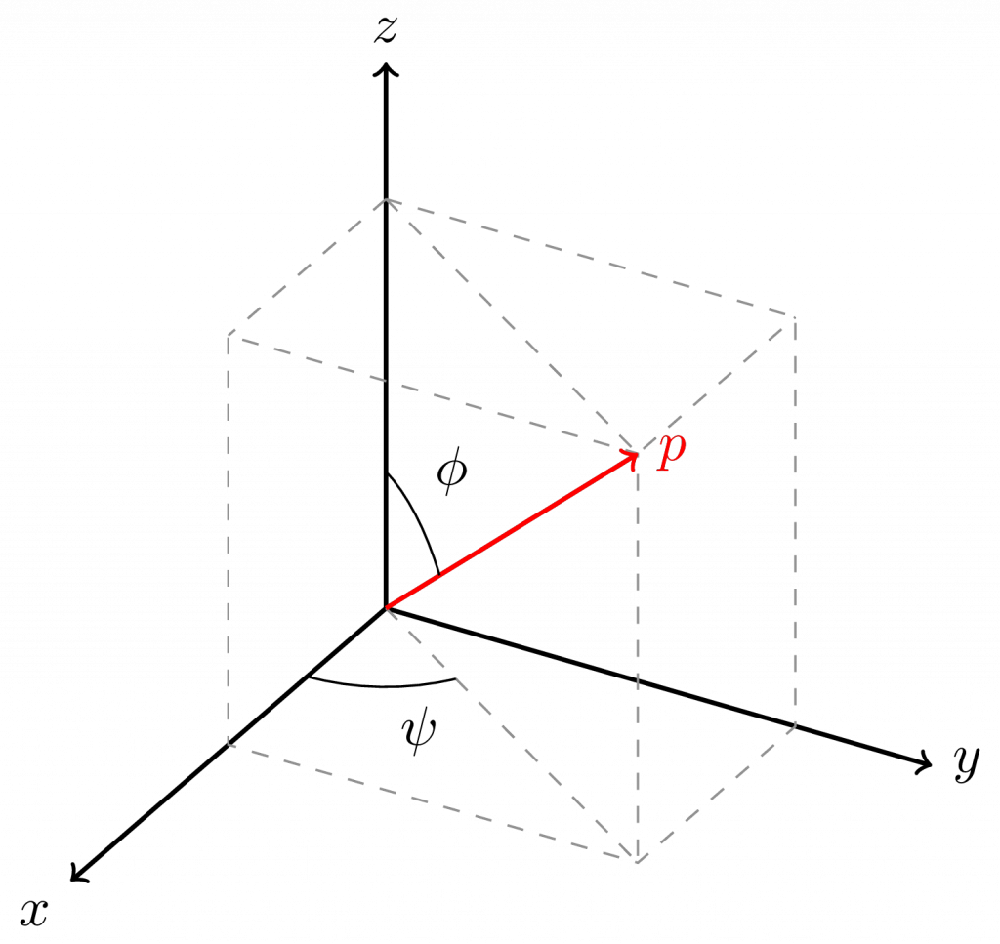

# Splice Molecule

## Ideas

将 A 和 B 的分子连接在一起，具体是将原子 a 和原子 b 连接在一起，即将整个 B 分子移动，保证 b 原子和 a 原子之间的距离在`1.0 * (ra + rb)`, ra 和 rb 分别是两个原子的范德华半径，同时要保证 A B 两个分子片段不能有重合。

该功能的实现主要考虑如何让分子拼接后其片段尽量没有重合，对需要拼接的分子寻找一个中心点，将中心点到分子拼接点作为分子的特征向量。在拼接的时候，我们主要考虑将两个拼接的分子的特征向量通过三维的旋转和平移的操作达到**特征向量的共线以及逆向**，这样拼接的分子涉及到的接触原子较少。

对于分子的中心点选择，主要考虑为分子建立一个最小包含该分子的立方体，然后将该立方体的中心点作为该分子的中心点。

## 3D Rotation Matrix

对于三维空间的点$P(x, y, z)$，要将其绕 $z$ 轴旋转 $\theta$ 角度可以很简单地用旋转矩阵来表示

$$ R_z(\theta) = \begin{bmatrix}cos\theta & -sin\theta & 0 \\ sin\theta & cos\theta & 0 \\ 0 & 0 & 1 \\ \end{bmatrix}$$

类似地，绕另外两个坐标轴旋转的矩阵可以表示如下

$$ R_x(\theta) = \begin{bmatrix}1 & 0 & 0 \\ 0 & cos\theta & -sin\theta \\ 0 & sin\theta & cos\theta \\ \end{bmatrix}$$

$$ R_y(\theta) = \begin{bmatrix}cos\theta & 0 & sin\theta \\ 0 & 1 & 0 \\ -sin\theta & 0 & cos\theta \\ \end{bmatrix}$$

对于三个特殊的旋转轴的旋转的解决方案已经知道了，由此可以进行推导对于任意的轴 $p$ 的旋转矩阵，将这个旋转分解：
1. 将整个坐标轴旋转，使得旋转轴 $p$ 和 $z$ 轴重合
2. 将点 $P$ 绕 $z$ 轴旋转 $\theta$ 角度
3. 将整个坐标轴旋转回到原位

如上所示，可以用角 $\phi$ 和 $\psi$ 表示一个旋转轴的位置（此处认为旋转轴 $p$ 为一个单位向量）

$$
\begin{cases}
x = sin\phi cos\psi \\
y = sin\phi sin\psi \\
z = cos\phi 
\end{cases}
$$

这样绕任意轴 $p$ 旋转 $\theta$ 度表示如下

$$R_z(\psi)R_y(\phi)R_z(\theta)R_y(-\phi)R_z(-\psi)$$

或者可以利用$R(-\alpha) = R^{-1}(\alpha) = R^T(\alpha)$，可以改写成

$$R_z(\psi)R_y(\phi)R_z(\theta)R_y^T(\phi)R_z^T(\psi)$$

化简得到最终的旋转矩阵

$$ T = \begin{bmatrix}cos\theta + x^2(1 - cos\theta) & xy(1 - cos\theta) - zsin\theta & xz(1 - cos\theta) + ysin\theta \\ yx(1-cos\theta)+zsin\theta & cos\theta+y^2(1-cos\theta) & yz(1-cos\theta)-xsin\theta \\ zx(1-cos\theta)-ysin\theta & zy(1-cos\theta)+xsin\theta & cos\theta+z^2(1-cos\theta) \\ \end{bmatrix}$$

此时将旋转矩阵左乘需要旋转的向量就可以得到旋转后的结果

$$P^{'} = T * P $$

## Process

对于三维中任意轴的旋转矩阵已经完成推导，接下来阐述分子拼接算法中的具体实现流程

**需要注意的是流程中涉及到所有旋转角度都基于右手系坐标，取值范围为$[0, 2\pi)$**

将 B 分子通过旋转平移操作拼接到 A 分子的流程
1. 文件解析
    解析输入的`mol`文件，获取分子的相关信息

2. 确定旋转轴
    * 计算获取两个拼接分子的特征向量 $\vec{a}$ 和 $\vec{b}$，同时计算 $\vec{a}$ 的反方向向量 $\vec{a^{'}}$
    * 判断 $\vec{a^{'}}$ 与 $\vec{b}$ 是否平行
      * 若平行且向量的方向相同，说明两个分子结构的特征向量可直接通过简单的平移即可共线。否则，特征向量仍需要简单的旋转来达到反向。判断 $\vec{b}$ 是否与 $z$ 轴平行，若不平行直接将旋转轴设定为 `{0, 0, 1}`，让其直接绕 $z$ 轴旋转 $\pi$ 即可， 否则设定为 `{0, 1, 0}`，让其绕 $y$ 轴旋 $\pi$。
      * 若不平行，将 $\vec{a^{'}}$ 与 $\vec{b}$ 的法向量作为旋转轴
        * 法向量 $\vec{\beta} = \vec{a^{'}} \times \vec{b}$
        * 依据上面的[推导流程](#3d-rotation-matrix)，计算并得到旋转矩阵 $T$
3. 计算旋转角度 $\theta$
    旋转角度的计算直接根据向量夹角即可获得，但是需要注意旋转角度基于右手系坐标，因此需要确认真正的旋转角度为 $\theta$ 还是 $2\pi-\theta$

    $$ cos\theta = \frac{\vec{a^{'}} \cdot \vec{b}} {|\vec{a^{'}}| \cdot |\vec{b}|} $$

    $$ \Rightarrow \theta = acos(\theta) $$
4. 平移
    将分子 B 中所有的点都进行旋转操作
        $$ P^{'} = T * P $$
    计算分子 B 相应的拼接点 b 相应的位置。根据我们的设计，b 的相应位置应当在  $\vec{a}$ 的延长线上，并且与分子 A 中相应的拼接点 a 的距离为 $ dis = 1.0 * (r_a + rb) $，因此可以直接计算得到 b 相应的位置为
        $$ k = \frac{dis}{|\vec{a}|} $$
        $$\Rightarrow  P_{b_{new}} = P_a + k * \vec{a} $$
    然后计算整体矩阵的偏移向量
        $$v_{offset} = P_{b_{new}} - P_b^{'}$$
    再将分子 B 中所有的点都进行平移操作，完成了分子拼接的过程
        $$P^{''} = P^{'} + v_{offset}$$

## Example

**Molecule A**

**Molecule B**

**Splice Result**

## Reference
* [三维空间中的旋转：旋转矩阵、欧拉角](http://blog.miskcoo.com/2016/12/rotation-in-3d-space)